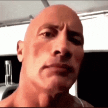

# therockware

Every mouse click pops **the-rock.gif** at the pointer and fires
**explosion-meme.mp3**. macOS and Windows, one self-contained binary each —
the media is compiled in (`assets_data.h`), so the installed program loads
nothing off disk.

<div style="text-align: center;">
  
</div>

<br>

```
mac.cpp   ->  build/therockware       (Objective-C++ / Cocoa)
win.cpp   ->  build/therockware.exe   (Win32 / WIC / Media Foundation / XAudio2)
```

## macOS

```
./install.sh      # build, install to ~/Library/Application Support, start at login
./uninstall.sh
```

Grant Accessibility once (System Settings → Privacy & Security → Accessibility)
for `~/Library/Application Support/TheRockWare/therockware`. The 🪨 menu bar
icon shows ⚠️ until that lands, then goes live by itself — no restart.
Menu: **Pause** / **Test Pop** / **Quit**.

## Windows

From an **x64 Native Tools Command Prompt for VS**:

```
build.bat
powershell -ExecutionPolicy Bypass -File sign.ps1 -SelfSigned
build\therockware.exe --install      ( --uninstall to undo )
```

`--install` copies the exe to `%LOCALAPPDATA%\TheRockWare`, adds the HKCU `Run`
key, and starts it. It lives in the notification area — right-click for
**Pause** / **Test Pop** / **Start with Windows** / **Quit**.

Two things worth knowing:

- Low-level mouse hooks don't see clicks inside windows running as
  administrator unless this process is elevated too. Normal apps are fine.
- **On "trusted":** the exe is built `asInvoker` (no UAC prompt), carries full
  version info and an icon, and links the static CRT so there's no redist
  dependency — but SmartScreen trust only comes from an Authenticode signature.
  `sign.ps1 -SelfSigned` mints a cert, installs it into your CurrentUser Root +
  TrustedPublisher stores and signs — properly trusted on machines that have
  that cert, which is what you want for personal use. For a stranger
  downloading it you need a real CA cert: `sign.ps1 -PfxPath cert.pfx`, and only
  an **EV** cert gets SmartScreen reputation immediately. A global mouse hook is
  also the kind of thing heuristic AV eyes — signing plus the version resource
  is what keeps it quiet.

## How it works

| piece | macOS | Windows |
|---|---|---|
| click detection | `CGEventTap`, listen-only | `WH_MOUSE_LL` hook, passes through |
| the popup | borderless transparent `NSWindow`, `ignoresMouseEvents`, screensaver level | layered window, `WS_EX_TRANSPARENT`/`TOPMOST`/`NOACTIVATE`, `UpdateLayeredWindow` |
| positioning | centred on `NSEvent.mouseLocation` | centred on the hook's point, DPI-scaled |
| the gif | ImageIO frames → discrete `CAKeyframeAnimation` | WIC frames, disposal composited by hand → DIB blits |
| the sound | `AVAudioPlayer` | Media Foundation → PCM in memory → XAudio2 |
| the media | compiled into the binary | compiled into the binary |

No GIF library, no external player, no temp files on either side. Six pop
windows and six audio voices are pooled, so machine-gun clicking gets a pop per
click instead of one that keeps restarting.

The Windows hook callback does nothing but `PostMessage` the point to the
message loop — low-level hooks are on a hard timeout and Windows silently
unhooks anything slow.

## Rebuilding

```
./embed_assets.sh   # re-bake assets/ into assets_data.h after swapping media
./build.sh          # macOS
build.bat           # Windows
```

The Windows tray/exe icon is one frame of the gif, baked in via `win.rc`:

```
./make_icon.sh 11   # frame 11 = the eyebrow raise (default); 12 frames, 0-11
```

It extracts that frame with ImageIO and assembles a 6-size (16-256px) .ico.
